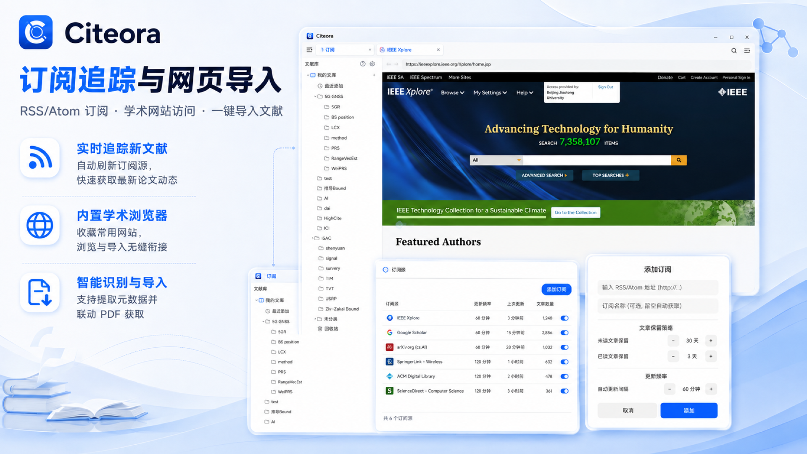
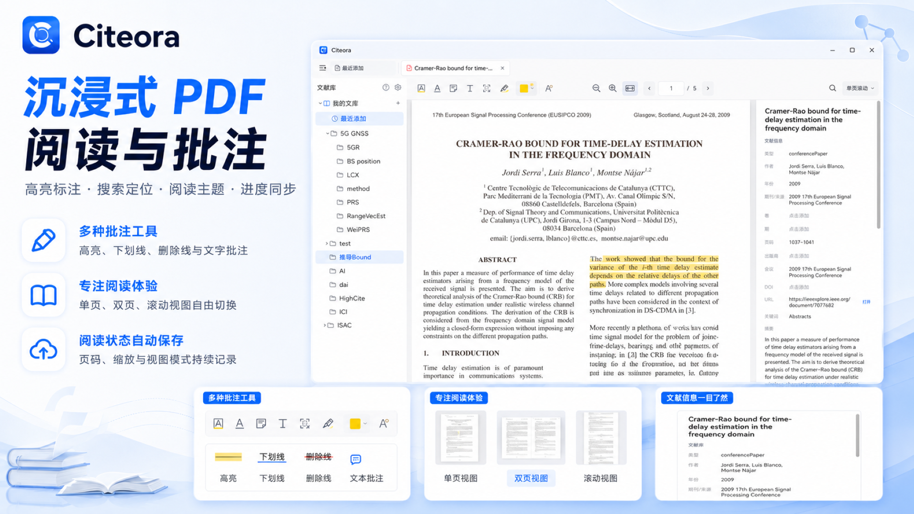
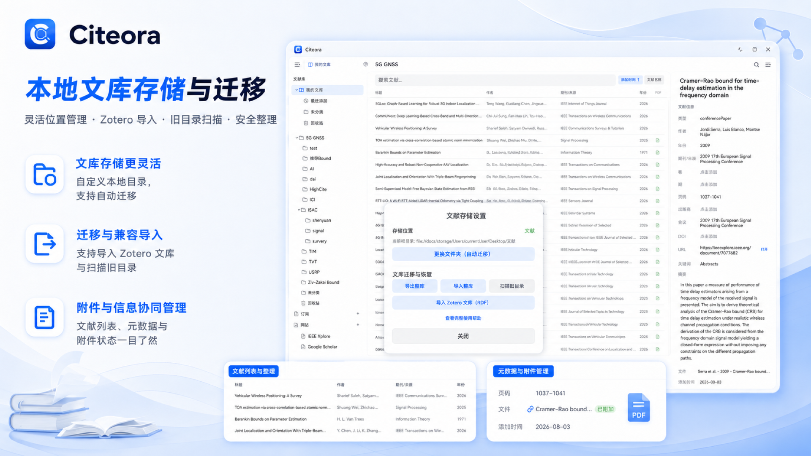
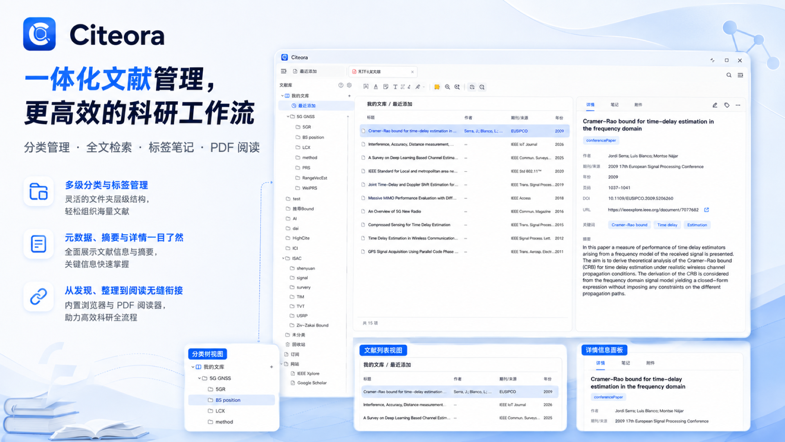

# Citeora

<p align="center">
  
</p>


<p align="center">
  <strong>为鸿蒙打造的学术文献管理器</strong>
</p>

<p align="center">
  <a href="#功能特性">功能</a> •
  <a href="#截图">截图</a> •
  <a href="#技术栈">技术栈</a> •
  <a href="#构建与运行">构建</a> •
  <a href="#数据存储">存储</a>
</p>

---

Citeora 是一款运行在 HarmonyOS NEXT 上的原生学术文献管理应用，面向平板和二合一设备设计。它将文献管理、PDF 阅读、智能导入、RSS 订阅和数据同步整合在一个工作区中，帮助研究者高效管理个人文献库。

## 功能特性

### 📚 文献库管理

- **分类体系**：树形收藏夹结构，支持多级嵌套分类、拖拽排序
- **文献元数据**：标题、作者、年份、期刊/会议、DOI、关键词、摘要等 15+ 字段
- **标签系统**：为文献添加自定义标签，支持按标签筛选
- **阅读状态**：未读 / 在读 / 已读三种状态，自动标记
- **星标收藏**：快速标记重要文献
- **回收站**：删除文献进入回收站，30 天自动清理，支持恢复与永久删除
- **全文搜索**：跨标题、作者、摘要等字段进行模糊检索

### 📄 PDF 阅读

- **内置阅读器**：基于 PDF.js 的原生渲染引擎
- **阅读状态持久化**：自动记录阅读位置，下次打开继续阅读
- **文本标注**：支持高亮、下划线、删除线等标注类型
- **笔记批注**：在 PDF 中添加文字笔记
- **页面跳转**：输入页码快速跳转
- **搜索**：Zotero 风格黄/橙高亮搜索结果，显示匹配计数与导航
- **阅读主题**：浅色 / 深色 / 棕褐纸色 / 自定义配色
- **缩放模式**：适应宽度 / 适应页面

### 🧠 智能导入

- **DOI 导入**：输入 DOI 即可自动获取元数据并下载 PDF
- **URL 导入**：粘贴论文页面链接，自动识别 DOI、提取元数据和 PDF
- **IEEE 专用**：针对 IEEE Xplore 优化，通过 stamp.jsp 提取真实 PDF 地址
- **Unpaywall 开放获取**：自动查找 OA 版本 PDF
- **CrossRef 元数据**：通过 DOI 和标题检索 Crossref 数据库获取完整文献信息
- **网页导入**：在嵌入式浏览器中浏览论文页面，一键导入当前页面文献
- **重复检测**：自动检测已有文献，已有 PDF 则跳过，无 PDF 则补充附件
- **文库上下文绑定**：从文库中无 PDF 文献打开网站导入时，PDF 自动绑定到原有文献

### 🌐 嵌入式浏览器

- **工作区标签页**：网站以标签页形式嵌入工作区，不打断阅读流程
- **浏览器工具栏**：地址栏 + 导入按钮，随时导入当前页面文献
- **Cookie 同步**：浏览器 Cookie 自动同步到 HTTP 请求，支持校园网访问
- **PDF 抓取**：自动检测页面中的 PDF 链接，无需手动下载

### 📡 RSS 订阅

- **订阅源管理**：添加、编辑、删除 RSS 订阅
- **自动刷新**：定期拉取最新文章
- **未读计数**：侧边栏显示各订阅未读数
- **文章详情**：右侧栏展示摘要全文
- **在线阅读**：点击链接打开原文网页

### 🏷️ 引用导出

- **BibTeX**：将文献导出为 BibTeX 格式
- **APA / MLA / Chicago**：多种引用格式一键复制
- **批量导出**：支持多选文献批量导出

### 🔄 数据迁移

- **Zotero RDF 导入**：从 Zotero 导出 RDF 文件，导入收藏夹结构、文献元数据和 PDF 附件
- **Citeora 归档导出/导入**：将整个文献库导出为归档文件，在新设备上恢复
- **V2 迁移**：从旧版数据结构自动迁移到新版

### 🎨 深色模式与无障碍

- **完整深色模式**：28 个语义化颜色资源，深/浅色主题全局覆盖
- **WCAG 2.1 AA 对比度**：正文 ≥4.5:1，禁用态 ≥3:1
- **系统跟随**：自动跟随系统深色模式设置

### 🖥️ 多窗口工作区

- **三栏布局**：左侧分类树 + 中间列表 + 右侧详情
- **可折叠侧边栏**：左右侧栏独立折叠/展开
- **标签页系统**：文库/收藏、PDF、网站以标签页切换
- **状态持久化**：重新打开应用后恢复上次的工作区标签页和分类选中状态

## 截图

| 文献库 | PDF 阅读 |
|:---:|:---:|
|  |  |

| 智能导入 | 整体视图 |
|:---:|:---:|
|  |  |

## 技术栈

| 层级 | 技术 |
|------|------|
| 平台 | HarmonyOS NEXT (SDK 6.1.1) |
| 语言 | ArkTS (TypeScript 严格子集) |
| UI 框架 | ArkUI 声明式 |
| 数据库 | 关系型数据库 (RDB) |
| 偏好存储 | Preferences |
| PDF 渲染 | PDF.js |
| 网络 | @kit.NetworkKit HTTP |
| 文件系统 | @kit.CoreFileKit |
| 设备类型 | 平板、PC |

## HAP安装

### 环境要求

- HarmonyOS SDK NEXT (API 13+, 兼容 API 12)
- 目标设备：平板或 2in1

### 方式1：使用hdc命令安装

这是最基础的方式，也是hdc比较常用的命令之一，其中的 `-r` 参数是代表覆盖安装应用

```shell
hdc app install -r xxx.hap
```

另外OpenHarmony还提供了一个包管理工具，简称bm，是实现应用安装、卸载、更新、查询等功能的工具

```shell
hdc shell
bm install -r /data/local/tmp/xxx.hap
```

### 方式2：使用浏览器社区版网页下载安装

- 支持在任意网站上下载并安装hap，当然，你完全可以去薅 gitee 的发行版下载链接。这种方式最大的好处就是，你可以任意的分发hap应用，甚至自建网站。
- 下载地址：https://gitee.com/ohos-dev/browser-ce/releases
- 实现细节：https://gitee.com/westinyang/browser-ce/blob/master/entry/src/main/ets/common/CustomDialog.ets

### 方式3：使用HAP查看器安装

- 既能查看hap信息，也能方便的安装、卸载、重装应用，并且还是跨平台的，支持Windows、macOS、Linux，也是我比较推荐的一种方式！
- 下载地址：https://gitee.com/ohos-dev/hap-viewer/releases

## 数据存储

### 内部存储模式（默认）

数据存储在应用沙箱内：
- 文献数据库：`context.databaseDir/rdb/CiteoraDB`
- PDF 附件：`context.filesDir/Storage/<HEXID>/`
- 偏好设置：`context.preferencesDir/`

### 外部存储模式

用户可选择将文献库同步到外部文件夹（通过 SAF 选择目录）：
- 元数据 JSON 文件按分类写入外部目录
- PDF 附件同时复制到外部目录的对应分类文件夹
- 沙箱副本保留为权威来源，外部副本为镜像
- 支持与其他文献管理软件（如 Zotero）的文件目录共存

### 数据安全

- 启动时数据库完整性校验，损坏自动重建
- 文件操作全部 try/catch 包裹，防止 I/O 异常崩溃
- 附件数据库行与磁盘文件一致性验证
- 30 天回收站保留期，过期自动清理

# Citeora

<p align="center">
  
</p>


<p align="center">
  <strong>为鸿蒙打造的学术文献管理器</strong>
</p>

<p align="center">
  <a href="#功能特性">功能</a> •
  <a href="#截图">截图</a> •
  <a href="#技术栈">技术栈</a> •
  <a href="#构建与运行">构建</a> •
  <a href="#数据存储">存储</a>
</p>

---

Citeora 是一款运行在 HarmonyOS NEXT 上的原生学术文献管理应用，面向平板和二合一设备设计。它将文献管理、PDF 阅读、智能导入、RSS 订阅和数据同步整合在一个工作区中，帮助研究者高效管理个人文献库。

## 功能特性

### 📚 文献库管理

- **分类体系**：树形收藏夹结构，支持多级嵌套分类、拖拽排序
- **文献元数据**：标题、作者、年份、期刊/会议、DOI、关键词、摘要等 15+ 字段
- **标签系统**：为文献添加自定义标签，支持按标签筛选
- **阅读状态**：未读 / 在读 / 已读三种状态，自动标记
- **星标收藏**：快速标记重要文献
- **回收站**：删除文献进入回收站，30 天自动清理，支持恢复与永久删除
- **全文搜索**：跨标题、作者、摘要等字段进行模糊检索

### 📄 PDF 阅读

- **内置阅读器**：基于 PDF.js 的原生渲染引擎
- **阅读状态持久化**：自动记录阅读位置，下次打开继续阅读
- **文本标注**：支持高亮、下划线、删除线等标注类型
- **笔记批注**：在 PDF 中添加文字笔记
- **页面跳转**：输入页码快速跳转
- **搜索**：Zotero 风格黄/橙高亮搜索结果，显示匹配计数与导航
- **阅读主题**：浅色 / 深色 / 棕褐纸色 / 自定义配色
- **缩放模式**：适应宽度 / 适应页面

### 🧠 智能导入

- **DOI 导入**：输入 DOI 即可自动获取元数据并下载 PDF
- **URL 导入**：粘贴论文页面链接，自动识别 DOI、提取元数据和 PDF
- **IEEE 专用**：针对 IEEE Xplore 优化，通过 stamp.jsp 提取真实 PDF 地址
- **Unpaywall 开放获取**：自动查找 OA 版本 PDF
- **CrossRef 元数据**：通过 DOI 和标题检索 Crossref 数据库获取完整文献信息
- **网页导入**：在嵌入式浏览器中浏览论文页面，一键导入当前页面文献
- **重复检测**：自动检测已有文献，已有 PDF 则跳过，无 PDF 则补充附件
- **文库上下文绑定**：从文库中无 PDF 文献打开网站导入时，PDF 自动绑定到原有文献

### 🌐 嵌入式浏览器

- **工作区标签页**：网站以标签页形式嵌入工作区，不打断阅读流程
- **浏览器工具栏**：地址栏 + 导入按钮，随时导入当前页面文献
- **Cookie 同步**：浏览器 Cookie 自动同步到 HTTP 请求，支持校园网访问
- **PDF 抓取**：自动检测页面中的 PDF 链接，无需手动下载

### 📡 RSS 订阅

- **订阅源管理**：添加、编辑、删除 RSS 订阅
- **自动刷新**：定期拉取最新文章
- **未读计数**：侧边栏显示各订阅未读数
- **文章详情**：右侧栏展示摘要全文
- **在线阅读**：点击链接打开原文网页

### 🏷️ 引用导出

- **BibTeX**：将文献导出为 BibTeX 格式
- **APA / MLA / Chicago**：多种引用格式一键复制
- **批量导出**：支持多选文献批量导出

### 🔄 数据迁移

- **Zotero RDF 导入**：从 Zotero 导出 RDF 文件，导入收藏夹结构、文献元数据和 PDF 附件
- **Citeora 归档导出/导入**：将整个文献库导出为归档文件，在新设备上恢复
- **V2 迁移**：从旧版数据结构自动迁移到新版

### 🎨 深色模式与无障碍

- **完整深色模式**：28 个语义化颜色资源，深/浅色主题全局覆盖
- **WCAG 2.1 AA 对比度**：正文 ≥4.5:1，禁用态 ≥3:1
- **系统跟随**：自动跟随系统深色模式设置

### 🖥️ 多窗口工作区

- **三栏布局**：左侧分类树 + 中间列表 + 右侧详情
- **可折叠侧边栏**：左右侧栏独立折叠/展开
- **标签页系统**：文库/收藏、PDF、网站以标签页切换
- **状态持久化**：重新打开应用后恢复上次的工作区标签页和分类选中状态

## 截图

|                      文献库                       |                     PDF 阅读                      |
| :-----------------------------------------------: | :-----------------------------------------------: |
|  |  |

|                      智能导入                       |                      整体视图                       |
| :-------------------------------------------------: | :-------------------------------------------------: |
|  |  |

## 技术栈

| 层级     | 技术                        |
| -------- | --------------------------- |
| 平台     | HarmonyOS NEXT (SDK 6.1.1)  |
| 语言     | ArkTS (TypeScript 严格子集) |
| UI 框架  | ArkUI 声明式                |
| 数据库   | 关系型数据库 (RDB)          |
| 偏好存储 | Preferences                 |
| PDF 渲染 | PDF.js                      |
| 网络     | @kit.NetworkKit HTTP        |
| 文件系统 | @kit.CoreFileKit            |
| 设备类型 | 平板、2in1                  |

## HAP安装

### 环境要求

- HarmonyOS SDK NEXT (API 13+, 兼容 API 12)
- 目标设备：平板或 2in1

### 方式1：使用hdc命令安装

这是最基础的方式，也是hdc比较常用的命令之一，其中的 `-r` 参数是代表覆盖安装应用

```shell
hdc app install -r xxx.hap
```

另外OpenHarmony还提供了一个包管理工具，简称bm，是实现应用安装、卸载、更新、查询等功能的工具

```shell
hdc shell
bm install -r /data/local/tmp/xxx.hap
```

### 方式2：使用浏览器社区版网页下载安装

- 支持在任意网站上下载并安装hap，当然，你完全可以去薅 gitee 的发行版下载链接。这种方式最大的好处就是，你可以任意的分发hap应用，甚至自建网站。
- 下载地址：https://gitee.com/ohos-dev/browser-ce/releases
- 实现细节：https://gitee.com/westinyang/browser-ce/blob/master/entry/src/main/ets/common/CustomDialog.ets

### 方式3：使用HAP查看器安装

- 既能查看hap信息，也能方便的安装、卸载、重装应用，并且还是跨平台的，支持Windows、macOS、Linux，也是我比较推荐的一种方式！
- 下载地址：https://gitee.com/ohos-dev/hap-viewer/releases

## 数据存储

### 内部存储模式（默认）

数据存储在应用沙箱内：
- 文献数据库：`context.databaseDir/rdb/CiteoraDB`
- PDF 附件：`context.filesDir/Storage/<HEXID>/`
- 偏好设置：`context.preferencesDir/`

### 外部存储模式

用户可选择将文献库同步到外部文件夹（通过 SAF 选择目录）：
- 元数据 JSON 文件按分类写入外部目录
- PDF 附件同时复制到外部目录的对应分类文件夹
- 沙箱副本保留为权威来源，外部副本为镜像
- 支持与其他文献管理软件（如 Zotero）的文件目录共存

### 数据安全

- 启动时数据库完整性校验，损坏自动重建
- 文件操作全部 try/catch 包裹，防止 I/O 异常崩溃
- 附件数据库行与磁盘文件一致性验证
- 30 天回收站保留期，过期自动清理

## 版本

当前版本：2.3.23 (buildVersion 23)

- versionCode: 2030023
- versionName: 2.3.23
- 最低兼容 SDK: API 22
- 目标 SDK: API 24
